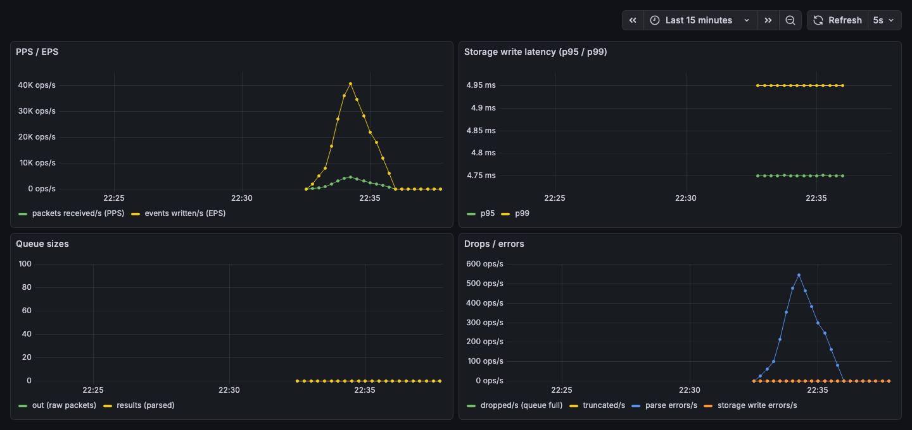

<h1 align="center">umbrella</h1>
<p align="center"><b>Высокопроизводительный SIEM telemetry collector на Go</b><br>
NetFlow v5/v9, IPFIX, Syslog (RFC 5424) и CEF — приём → нормализация → ClickHouse/Kafka, с observability через Prometheus/Grafana и производительностью, подтверждённой бенчмарками.</p>

<p align="center">
  <a href="https://github.com/SultanIsaev/umbrella/actions/workflows/ci.yml"></a>
  
  <a href="./LICENSE"></a>
</p>

---

## Зачем этот проект

Это капстоун-проект, сделанный, чтобы показать senior-уровень в Go для роли
SIEM/telemetry-collector: конкурентность под реальной нагрузкой (worker
pool, backpressure, graceful shutdown), разбор бинарных протоколов (темплейт-based state machine у NetFlow/IPFIX),
подключаемые storage-
бэкенды (батч-инсерты в ClickHouse, producer/consumer для Kafka) и,
что важнее всего, — **заявления о производительности, подтверждённые
`benchstat`, а не интуицией**. Каждая цифра ниже воспроизводима командой,
которая указана рядом.

Сервис принимает UDP-телеметрию, разбирает её в типизированную модель событий и пишет в production-grade хранилище,
а метрики можно вживую наблюдать в Grafana прямо во время работы.

## Что происходит внутри, одной картинкой

```
                UDP :2055                    fan-out / fan-in           storage.Storage
        ┌────────────────────┐        ┌────────────────────────────┐    ┌───────────────────────┐
        │  internal/ingest   │        │  internal/pipeline         │    │ internal/storage/     │
 pkts ─▶│  (Listener,        │──out──▶│  (worker pool,             │───▶│   clickhouse (batch)  │
        │   SO_RCVBUF,       │  chan  │   GOMAXPROCS workers)      │    │   kafka (producer)    │
        │   drop+metric on   │        │                            │    │   stub (log/memory)   │
        │   backpressure)    │        │  internal/netflow v5/v9    │    └───────────────────────┘
        └────────────────────┘        │  internal/ipfix            │
                                      │  internal/syslog (RFC 5424)│
                                      │  internal/cef              │
                                      └────────────────────────────┘
                                                    │
                                                    ▼
                                    internal/observability (Prometheus)
                                       PPS/EPS, p95/p99, queue depth
                                                    │
                                                    ▼
                                        :8080  /metrics  /healthz
                                               /debug/pprof/*
```

`cmd/collector` связывает всё это воедино с graceful shutdown по сигналам (`os/signal` + `context`, `errgroup`);
`cmd/loadgen` — генератор трафика,
которым сделаны все нагрузочные тесты и бенчмарки в этом README.

## Что это демонстрирует (для тех, кто спешит)

| Область                                                               | Где                                    | Доказательство                                                                                                                                              |
|-----------------------------------------------------------------------|----------------------------------------|-------------------------------------------------------------------------------------------------------------------------------------------------------------|
| Конкурентность: worker pool, fan-in/out, bounded queues, backpressure | `internal/ingest`, `internal/pipeline` | `go test -race`, `goleak` в каждом конкурентном пакете                                                                                                      |
| Разбор бинарных протоколов со стейтфул-темплейтами                    | `internal/netflow`, `internal/ipfix`   | Table-driven тесты + фикстуры в `test/testdata/`; edge case "data record раньше темплейта" — реальный тест, а не предположение                              |
| Fuzz-протестированные текстовые парсеры                               | `internal/syslog`, `internal/cef`      | `go test -fuzz`, миллионы прогонов, ноль падений (засеянные корпуса)                                                                                        |
| Storage-бэкенды                                                       | `internal/storage/{clickhouse,kafka}`  | Батчинг size-or-timeout через `select`+`time.Timer` (без `time.Sleep`), at-least-once семантика Kafka-консьюмера                                            |
| Performance-работа с доказательствами                                 | `docs/benchmarks.md`                   | На основе `pprof`, подтверждено `benchstat` — включая одну гипотезу, которая оказалась **неверной** и была честно исправлена, а не скрыта                   |
| Наблюдаемость                                                         | `internal/observability`, `/metrics`   | Prometheus-счётчики/гистограммы + рабочий дашборд Grafana (скриншот ниже)                                                                                   |
| Поставка                                                              | `deploy/`, `docs/deployment.md`        | Статический бинарник подтверждён через `file`, реально замерен размер образа, systemd-юнит проверен на **настоящем `systemctl`**, а не только по синтаксису |

## Реальные цифры

Из [`docs/benchmarks.md`](./docs/benchmarks.md) (полный вывод `benchstat` и команды для воспроизведения — там же):

| Изменение                                                                            | Результат                                                                                                              |
|--------------------------------------------------------------------------------------|------------------------------------------------------------------------------------------------------------------------|
| NetFlow v5 encode/decode: ручная упаковка байт вместо reflection в `encoding/binary` | **-95.4%** времени, **-91.3%** аллокаций                                                                               |
| `storage.Event.Fields`: упорядоченный `[]Field` вместо `map[string]any`              | **-31.7%** времени, **-22.0%** памяти, **-13.4%** аллокаций                                                            |
| Форматирование IPv4: вручную вместо `net.IP.String()`                                | **-6.1%** времени; аллокации **не изменились** — честно отмечено как чисто CPU-выигрыш, без натяжки на экономию памяти |

Из [`docs/deployment.md`](./docs/deployment.md):

| Метрика                                            | Значение                                                                                                                                       |
|----------------------------------------------------|------------------------------------------------------------------------------------------------------------------------------------------------|
| Размер docker-образа (distroless/static, non-root) | **20 MiB**                                                                                                                                     |
| Статический бинарник                               | ✅ подтверждено через `file` (`statically linked`), `linux/amd64` + `linux/arm64`                                                              |
| systemd-юнит                                       | ✅ подтверждён `active (running)` на настоящем `systemctl`, `Restart=on-failure` проверен убийством процесса и наблюдением за его перезапуском |

## Живой пример

Дашборд Grafana, реально питающийся трафиком `NetFlow v5` от `cmd/loadgen`
через весь путь `ingest → pipeline → storage`,
метрики — скрейпятся с собственного `/metrics` коллектора:



*(PPS/EPS растёт по мере того, как `loadgen` проходит через разные профили
трафика; глубина очередей остаётся на 0 под этой нагрузкой — пайплайн
успевает без бэклога; latency на скриншоте — от дефолтного log-storage
стаба, суб-5мс и в основном упирается в разрешение bucket'ов гистограммы —
за цифрами по конкретным бэкендам смотри `docs/benchmarks.md`.)*

## Попробовать самому

Всё ниже — реальные `make`-таргеты, а не абстрактное "запустите сервер".
Никаких внешних аккаунтов и облаков — только Docker и Go локально.

```sh
# 1. Инфраструктура: ClickHouse + Redpanda(Kafka) + Prometheus + Grafana
make infra-up

# 2. Collector в фоне — дожидается реальной готовности /healthz (поллингом, не sleep),
#    поэтому терминал освобождается сразу, второе окно не нужно
make run-collector

# 3. Погонять трафик — выбери один вариант:
make run-loadgen-valid      # только валидный NetFlow v5
make run-loadgen-invalid    # только битые пакеты (проверка ветки отбраковки)
make run-loadgen-mixed      # оба сразу — именно тот сценарий, что на скриншоте выше

# с параметрами:
make run-loadgen-mixed LOADGEN_PPS=10000 LOADGEN_INVALID_PPS=1000 LOADGEN_DURATION=2m
```

Дальше открой **http://localhost:3000** — без логина, дашборд "Umbrella Collector" уже готов.

```sh
# остановить всё
make stop-collector
make infra-down          # или `make clean-all`, чтобы снести ещё и volumes + bin/
```

### Проверить планку качества самому

```sh
go build ./...
go vet ./...
golangci-lint run ./...
go test -race -count=1 ./...
```

Это ровно то же самое, что `.github/workflows/ci.yml` гоняет на каждый push и pull request.

### Подключить реальное хранилище

По умолчанию collector использует in-memory/log-заглушку (без какой-либо настройки).
Чтобы погонять настоящие production-бэкенды:

```sh
make clickhouse-up   # затем export UMBRELLA_CLICKHOUSE_DSN — см. configs/config.example.env
make redpanda-up     # затем export UMBRELLA_KAFKA_BROKERS
```

## Структура репозитория

```
cmd/collector/             точка входа сервиса — связывает всё нижеперечисленное воедино
cmd/loadgen/               UDP-генератор нагрузки, которым сделаны все бенчмарки и скриншот выше
internal/ingest/           UDP-приёмник: подбор SO_RCVBUF, backpressure (drop+метрика, без time.Sleep)
internal/pipeline/         worker pool: fan-out разбора, fan-in результатов, graceful drain при остановке
internal/netflow/          декодеры NetFlow v5 (фиксированный формат) и v9 (темплейт-based)
internal/ipfix/            декодер IPFIX (темплейт-based, тот же edge case "неизвестный темплейт", что и у v9)
internal/syslog/           декодер RFC 5424 syslog + TCP-фрейминг по RFC 6587
internal/cef/              декодер CEF (Common Event Format)
internal/storage/          интерфейс storage.Storage + бэкенды clickhouse/kafka + log/memory-заглушки
internal/observability/    Prometheus-метрики (/metrics) + структурированное логирование
internal/server/           операционный HTTP: /healthz, /metrics, /debug/pprof/*
internal/config/           конфигурация через переменные окружения, без хардкода
deploy/                    Dockerfile (multi-stage, distroless), systemd-юнит, docker-compose стек
docs/                      заметки по архитектуре, лог бенчмарков, верификация поставки, этот скриншот
test/testdata/             фикстуры для unit-тестов и seed-корпуса для fuzzing
```

## Статус проекта

Сделано строгой последовательностью вертикальных срезов (M0 → M14,
полная таблица Definition-of-Done — в [ROADMAP.md](./ROADMAP.md)) — **M0–M11 сделаны полностью**: ingest, worker pool,
NetFlow v5/v9, IPFIX,
Syslog/CEF (с fuzzing), ClickHouse, Kafka, реальный performance-проход,
наблюдаемость через Prometheus/Grafana и проверенная поставка
(статический бинарник, docker-образ, systemd-юнит).
M12–M14 (mTLS/auth, CI benchmark- gate, финальная полировка портфолио) — оставшаяся работа, отложена осознанно.

## Лицензия

[MIT](./LICENSE)
